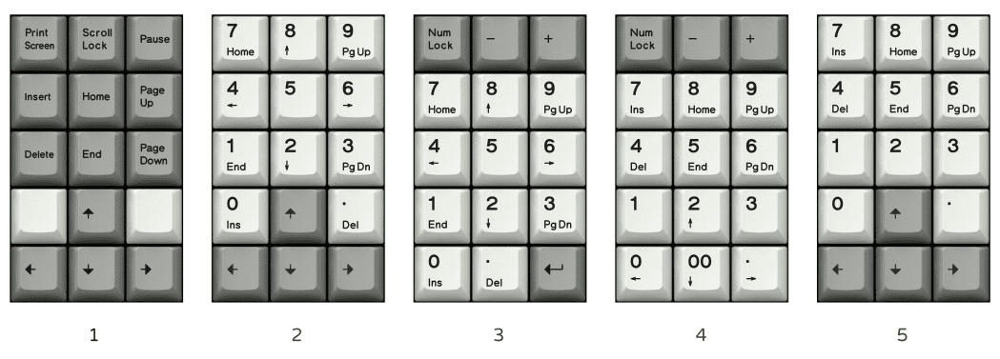

## vial-qmk for xwhatsit controller based keyboards

For (many of the) Model-F and (some) Beamspring style keyboards produced by: https://www.modelfkeyboards.com/
(newer models do not use the xwhatsit/wcass controller, they use a different fork of the firmware)

QMK open-source keyboard firmware: https://github.com/qmk/qmk_firmware

Vial is a fork of QMK to enable re-configuring without re-flashing: https://github.com/vial-kb/vial-qmk

QMK fork with support for xwhatsit based keyboards by Purdea Andrei: http://purdea.ro/qmk_firmware

That host went offline in mid-2025, branches are mirrored at: https://github.com/ploxiln/qmk_firmware

Support for xwhatstit based keyboards added to Vial by NathanA: https://www.newfxx-firmware.nconx.com/

That Vial support firmare is provided as an archive which contains built firmware,
windows and macOS tool to check capacitive keys, some patches and keyboard config files,
and a `build.sh` script which conglomerates the source tree that generated the built
artifacts by cherry-picking commits, applying patches, and copying configs ... it's a bit messy.
So, I made this repo/branch by following along and making attributed and dated commits.


### build vial firmware

This is reasonably straightforward on Linux or macOS.
On Windows you should use WSL2 (basically a Linux virtual-machine).

On macOS you should install [Homebrew](https://brew.sh/) to get a Linux-like package manager.

  * Install the "qmk" tool
    * You can install the "qmk" package from your Linux distro, or the official macOS Homebrew tap,
      but that pulls in dependencies on a bunch of tools only needed for other keyboard controllers.
      * Debian,Ubuntu,etc: "sudo apt install qmk"
      * Arch Linux: "sudo pacman -S qmk"
      * macOS: "brew install qmk/qmk/qmk
    * You can instead install "qmk" with Python 3.9+ in a few different ways, here's one:
      * `python3 -m venv qmkenv && . qmkenv/bin/activate && pip install qmk appdirs`
      * `. qmkenv/bin/activate`
      * `pip install qmk appdirs`
    * I like "pipx", you can install it from your package manager (or homebrew)
      * `pipx install qmk; pipx inject qmk appdirs`
  * Install "avr-gcc"
    * Debian,Ubuntu,etc: "sudo apt install gcc-avr"
    * Arch Linux: "sudo pacman -S avr-gcc"
    * macOS: "brew install osx-cross/avr/avr-gcc"

Now clone this repo and build:

```sh
git clone https://github.com/ploxiln/vial-qmk.git
cd vial-qmk
git submodule init
git submodule update
qmk compile keyboards/xwhatsit/brand_new_model_f/$MODEL/wcass/build.json
```

If that works, the resulting firmware file will be in the local directory, named like:
`xwhatsit_brand_new_model_f_*_wcass_*.hex`


### flash vial firmware

You can flash the firmware you built along with a keymap selected from
`keyboards/xwhatsit/brand_new_model_f/$MODEL/wcass/keymaps/$MODEL-*`
using the script `flash-util/flash_vial_xwhatsit.sh`.

  * install "dfu-programmer"
    * Debian,Ubuntu,etc: "sudo apt install dfu-programmer"
    * Arch Linux: "sudo pacman -S dfu-programmer"
    * macOS: "brew install dfu-programmer"
      or download from https://github.com/ploxiln/vial-qmk/releases

Run the script and specify both the firmware and the keymap hex files:

```sh
./flash-util/flash_vial_xwhatsit.sh xwhatsit_brand_new_model_f_XXX.hex \
          keyboards/xwhatsit/brand_new_model_f/$MODEL/wcass/keymaps/$MODEL-XXX.hex
```

On Linux you'll probably have to run it with "sudo" (but not on macOS).

You'll have to put the keyboard controller into "bootloader mode", there are a few different ways:

 1. Run the pandrew-util, and click the "Enter Bootloader" button
 2. Run Vial, and go to Security > "Reboot to bootloader"
 3. Press the key on your keyboard mapped to the "RESET" function
    (modelfkeyboards.com default is Fn+space+R)
 4. Physically short the two pads marked "PROG" on the controller while
    plugging the USB cable into the host PC

If you have a split ergonomic model, each half is seen by the host
computer as a discrete keyboard, and you will need to flash each half
separately. The two firmwares for the two halves are suffixed with
"left" / "right" or `_l` / `_r`.


### keymap decoder

The vial keymaps in `keyboards/xwhatsit/brand_new_model_f/*/wcass/keymaps/` have labels/modifiers
in their filenames with the following meanings:

 * base is either 'ansi' or 'iso':
   * ansi uses an ANSI Enter, and non-split left shift
   * iso uses an ISO Enter, and a split left shift
 * fn / hhshift / hhkb:
   * fn means: split right shift (HHKB-style),
     with rightmost 1U key being mapped to Fn
   * hhshift means: as above, but also Caps Lock
     and Left Ctrl are swapped relative to ANSI
   * hhkb means: as above, but "full HHKB"
     (backspace is moved down a row to replace
      1.5U backslash, original backspace is split)
 * nlock / simulock:
   * nlock means: enables the Num Lock layer 1 selection feature
   * simulock means: "simulated" Num Lock (used on F77 only)
 * optN: for F77, refers to the right-side block layout option,
   described at https://www.modelfkeyboards.com/product/f77-model-f-keyboard/
   


### build distribution archive

To build all xwhatsit/wcass vial firmwares as well as flash scripts for all available keymaps,
you need the build prerequisites from [build_vial_firmware](#build_vial_firmware),
then run the script (passing arbitrary desired version name):

```sh
./build_vial_xwhatsit_all.sh VERSION_NAME
```


### pandrew-util

You can compile the xwhatsit "pandrew-util" for linux like so:

```sh
sudo apt install build-essential libhidapi-dev qtbase5-dev
# or equivalent for your linux distro

git clone https://github.com/ploxiln/vial-qmk.git
cd vial-qmk/keyboards/xwhatsit/util/util

qmake util.pro  # or qmake-qt5
make

# hopefully that worked, now you can run it:
./util

# probably best to copy it somewhere better:
sudo cp -v util /usr/local/bin/pandrew-util
```

I switched from `-lhidapi-libusb` to `-lhidapi-hidraw` in `keyboards/xwhatsit/util/util/util.pro`
because hidraw seems to be the api used by the Vial app: https://get.vial.today/manual/linux-udev.html

You can also download "pandrew-util" built for linux from https://github.com/ploxiln/vial-qmk/releases
